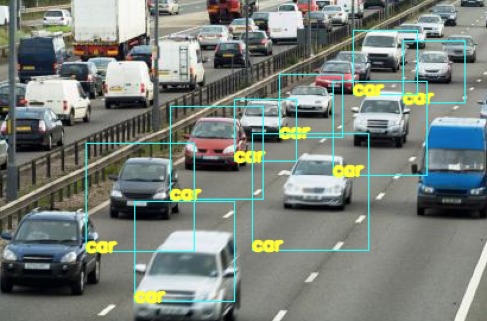
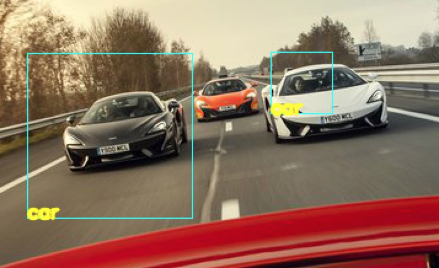
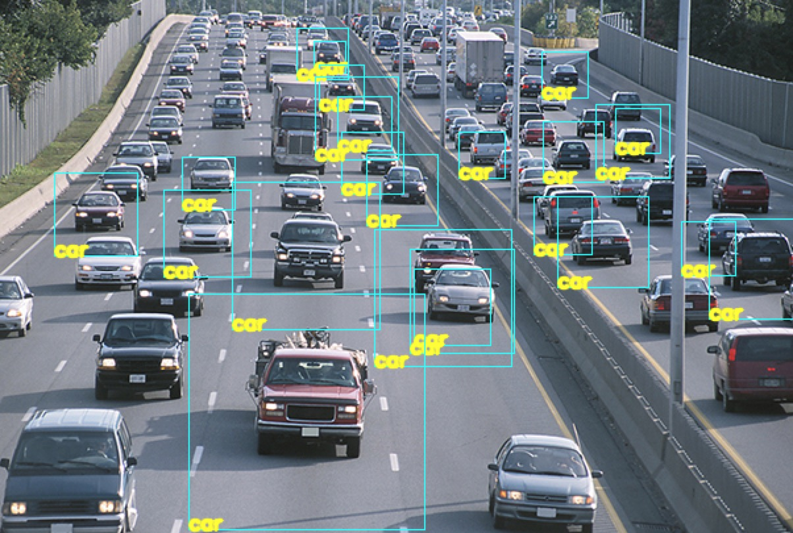
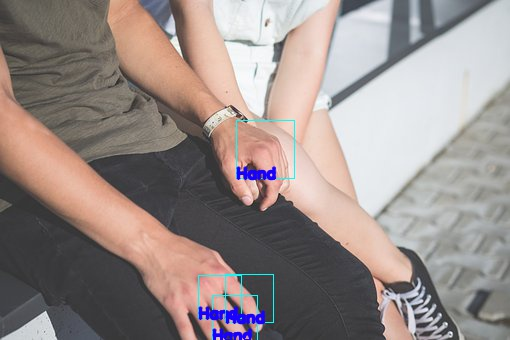
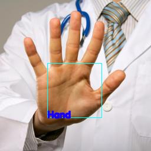

**Fall 2017 CS512 Project Report**

# Object detection using Image Processing

Lin Zhuo (A20379609), Venkata Naga Prajwal Challa (A20402812)

## Abstract

The main objective of this project is to develop an OpenCV based code in Python using Haar Cascade algorithm for face and object detection. The Python code was tested with the help of available database of images.


## 1. Introduction

Traditional object detection algorithms have been using the background and foreground segmentation to segment objects moving in the foreground, or calculate the geometric properties such as the number, size, shape, position, and trajectory of the objects, based on which the further application analysis can be conducted.

However, since there numbers of uncontrollable and unexpected interferences from the external
environment, such as shifted light and shadows, the interrupts of smoke, rain or the other objects, realistic information for foreground objects cannot be calculated.


## 2. Methodologies

### 2.1 Image Processing

In image processing an image is converted into digital form and certain operations are performed on it. The object detection is the algorithm to deal with detecting instances of semantic objects of a certain type, such as the vehicles, building, humans, etc. A block diagram of object detection is:

a) Image capture;
b) Feature detection;
c) collecting putative points;
d) object detection.

### 2.2 Object detection and tracking

A good candidate of algorithms in detecting object is the Haar Cascade function. The usage of Haar-like features in object detection is proposed first time by Paul Viola and Michael Jones in Viola & Jones (2001). This method then attracted so much attention from the others and a lot of people extended this method for a various field of object detection.


### 2.3 Haar features and the Voila Jones Framework

Haar features are used to detect the presence of different types of features in the image, which is similar to the convolution kernels. Each feature results in a single value which is calculated by subtracting the sum of pixels under the white rectangle from the sum of pixels under black rectangle.

![Some patterns of Haar fetures[2]](img/haar_feature.png)

Theoretically, for each pattern the size of white and black region can start from 1 pixel and grow exponentially up until the image size, for Viola Jones Framework in face detection, the ${24 \times 24}$ windows are used as the base window size to start evaluating the Haar features in any image. Despite the size is not large, if all the possible parameters of the Haar features are condisered, such as position, scale and type it will end up with calculating more than 160,000 features in this window.

The removal of redundant features can be done with Adaboost.


The Voila Jones Framework can be considered one of the robust detectors in object detection. There are 3 main ideas behind:

**a) The integral image**

Establishing the integral image can be helpful in calculating the intensity of a certain region in the image in constant time. It can be generated by the sum of intensity values in a rectangular subset of an image:

${ii(x,y) = \Sigma_{x'<=x;y'<=y} i(x', y')}$

where `i(x,y)` is the intensity of the gray scale image at `pixel(x,y)`.

The sum of the intensity pixels of any rectangular area ABCD can be calculated as:

${\Sigma_{(x,y) \in ABCD i(x,y) = ii(D)-ii(B)-ii(C)+ii(A)}}$


**b) Adaboost**

As above-mentioned, the Adaboost algorithm, which is a kind of machine learning algorithm, can be adapted to remove the un-useful features.The Adaboost algorithm of Viola and Jones is described
in [3].

Each of the selected features are considered reasonable to be included if they perform better than the random guesses. After these "weak" features are found, they are linearly combine with weights to form the "strong" classifier as following:

${F(x) = \alpha_1 f_1(x) + \alpha_2 f_2(x) + ... + \alpha_n f_n(x)}$

where ${F(x)}$ is the strong classifier formed by Adaboost and ${f_1(x), f_2(x), ..., f_n(x)}$ are all the weak classifiers with trained coefficients ${\alpha_1, \alpha_2, ... \alpha_n}$.

**c) Cascading**

A single strong classifier formed out of linear combination of all best features is not efficient to evaluate on each window because of the computation cost. In this situation, cascading provides an efficient way to discard the non-target object features quickly and spend more time on the probable regions.

The cascade classifier is composed of stages and each stage contains a strong classifier. All the features are grouped into several stages and each stage contains certain number of features.


### 2.4 Collect negative and positive images

The dataset for training comes from `image-net.org`.

The good candidates for negative images are those without the appearance of the object that needs to detect. In this project ${100 \times 100}$ images are formed to the background images. A background index file `bg.txt` is created to store the file paths of these image.  

The positive images are those containing the target object to be detected. For detecting a specific target the positive images can be generated via `opencv_createsamples` from superposing the image object onto each negative image with certain transformation in angle and location, as the following code:

`opencv_createsamples -img positive.jpg -bg -bg.txt -info positives/info.lst -pngoutput positives -maxxangle 0.3 -maxyangle 0.3 -maxzangle 0.5 -num 2000`

This function creates the positive samples based on the `positive.jpg` image that is specified which is indicated by the `-img` tag. `-bg` specifies the information of the backgrounds, which are the negative images extracted in the previous step. The `info.lst` stores the information of the artificially generated images including the location and size of the object in the image.

After generating the positive images, a vector file has to be created as the input parameters in the following cascade features training.

`opencv_createsamples -info positives/info.lst -w 20 -h 20 -num 2000 -vec positives.vec`

In the vector file it is stated where the info file is, the number of images are to be contained in the file, the dimensions of the images in this vector file and the destination to output the results.

### 2.5 Training Haar classifier using openCV

After the preparations are completed, the training process can be done via `opencv_traincascade` command by specifying the parameters:

* `-data`: the directory to store the output `.xml` classifier files
* `-vec`: define the vector file of the stiched positive images
* `-bg`: background information
* `numPos`: the number of positive images used for training
* `numNeg`: the number of negative images used for training
* `numStages`: the number of cascading stages


## 3. Result analysis

### 3.1 Haar classifier training

An example of the log output during openCV training is as follows.

```
===== TRAINING 8-stage =====
<BEGIN
POS count : consumed   1800 : 1882
NEG count : acceptanceRatio    900 : 0.0652221
Precalculation time: 7
+----+---------+---------+
|  N |    HR   |    FA   |
+----+---------+---------+
|   1|        1|        1|
+----+---------+---------+
|   2|        1|        1|
+----+---------+---------+
|   3|        1|        1|
+----+---------+---------+
|   4|        1| 0.998889|
+----+---------+---------+
... ... ...
+----+---------+---------+
|  96| 0.995556| 0.697778|
+----+---------+---------+
|  97| 0.995556|     0.67|
+----+---------+---------+
|  98| 0.995556| 0.633333|
+----+---------+---------+
|  99| 0.995556| 0.652222|
+----+---------+---------+
| 100| 0.995556|     0.63|
+----+---------+---------+
```
After starting the training program the logging information printed out from the terminal shows the parameters of each training stage.

Each row represents a feature that is being trained with the output of Hit Ratio (HA) and False Alarm Ratio (FA). After a stage is finished, an .xml (`stage[i].xml`)file is generated for storing the classifier.

After all the stages are completed an `.xml` file containing the final classifier for the use of object detection.

### 3.2 Object detection using Haar Cascade

Several types of objects were trained to obtain the classifiers, such as faces, cars and hands. The detected objects in the image are marked with rectangles and the texts. (See the appendix).


## References
[1] Fares Jalled et al., Object Detection Using Image Processing

[2] https://docs.opencv.org/2.4.13.2/modules/objdetect/doc/cascade_classification.html

[3] ir.library.louisville.edu/cgi/viewcontent.cgi?article = 2731&context = etd

## Appendix











